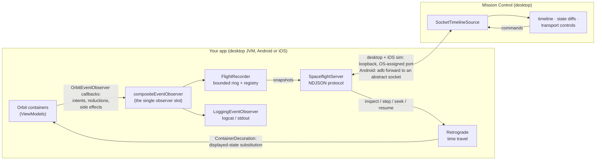

# Orbit Spaceflight

[](https://github.com/falcon4ever/orbit-spaceflight/actions)
[](LICENSE)


## What is Orbit Spaceflight

Orbit Spaceflight is a flight recorder and time-travel debugging suite for
[Orbit MVI](https://github.com/orbit-mvi/orbit-mvi). It records every intent,
reduction and side effect across all of your containers into a bounded
in-memory ring — always on, so the events from *before* a bug happened are
already there when you go looking.

Key features:

- **Flight Recorder:** always-on, bounded recording of intent lifecycle,
  reductions with before/after state, and side effects — across all
  containers, with per-container retention so chatty containers can't flush
  quiet ones.
- **Retrograde (time travel):** freeze every container's displayed state and
  scrub the real UI through recorded snapshots with a global cursor. Nothing
  re-executes: playback of states, not of the world. In-flight intents keep
  running (the live tail stays recorded), new intents queue, side effects hold
  until resume.
- **Mission Control:** a Compose Desktop client with container sidebar,
  filterable live timeline, per-field state diffs (recorded internal and
  derived external), and remote time-travel transport controls — attaches to
  desktop apps, Android devices/emulators (adb) and iOS simulators, all
  discovered automatically.
- **Structured logging:** one-line event logs with intent attribution and
  best-effort intent names (`CheckoutViewModel.loadData`), lazily built and
  pluggable into logcat or any sink.
- **Negligible overhead:** recording costs ~50 ns per reduction and nothing
  when disabled — see [benchmarks](benchmarks/RESULTS.md).
- **Multiplatform:** the engine is pure common code, built for the same
  targets as `orbit-core` — Android, iOS, desktop, JS and Wasm.

- **Session files:** redacted, gzipped `.orbitsession` exports from any app or
  from Mission Control itself, opened for offline review with a step-through
  cursor.

On the roadmap, built on the same recording engine: an **in-app Retrograde
overlay**, an **Android Studio plugin** hosting the Mission Control UI, and
**physical-device iOS attach** (usbmux).

## Project status

| Phase | Contents | Status |
|---|---|---|
| 1 | Recording engine, logging observer, benchmarks | ✅ done |
| 3 | Retrograde time-travel engine | ✅ done |
| 4 | Wire protocol, Mission Control client; desktop, Android (abstract socket, peer-authenticated, debuggable-only) and iOS-simulator attach | ✅ done |
| 2 | `.orbitsession` format, redaction, share flow, no-op twin artifact | ✅ done (crash dumps deferred) |
| 5 | In-app overlay, Android Studio plugin, iOS device attach | demand-driven |

(Phases are the plan's numbering; they shipped out of order.)

## How it fits together

Orbit's `@OrbitExperimental` observer SPI is the only touch point with your app's
containers: an `OrbitEventObserver` receives every intent, reduction and side effect,
and a `ContainerDecoration` lets Retrograde substitute what your UI displays. Everything
else builds outward from the recording.



Connecting is zero-configuration: desktop apps and iOS simulator apps announce their
OS-assigned port through a discovery file, and Android devices are found by reading the
device's socket table over adb and forwarding the abstract socket. Recorded states cross
the wire as rendered strings; nothing
in your app ever serializes, renders or blocks on a client — recording itself costs a
couple of references and a lock append.

## Getting started

Orbit Spaceflight is not yet published to Maven Central — it builds against an
in-review Orbit core SPI (see [Building](#building)). Once published:

```kotlin
// Recording engine: event model, ring buffer, registry (multiplatform)
implementation("io.github.falcon4ever:orbit-spaceflight:<latest-version>")

// Structured one-line event logging (multiplatform)
implementation("io.github.falcon4ever:orbit-spaceflight-logging:<latest-version>")
```

### Install the recorder

Install once at application startup, then wire the observer into Orbit:

```kotlin
val recorder = OrbitSpaceflight.install {
    capacity = 2_000                        // dogfood builds: 300
    minRetainedReductionsPerContainer = 25  // chatty containers can't flush quiet ones
    exclude("CountdownTimer")               // skip known-chatty containers
}

Orbit.configureDefaults {
    eventObserver = compositeEventObserver(
        recorder.eventObserver,
        LoggingEventObserver(sink = { Log.d("Orbit", it) }),
    )
}
```

Orbit usage stays exactly the same. The logging observer immediately produces
structured logs:

```text
CheckoutViewModel#1 created (initial=CheckoutState(items=[]))
CheckoutViewModel#1 > intent CheckoutViewModel.loadData#0 dispatched
CheckoutViewModel#1 ~ CheckoutState(items=[]) -> CheckoutState(items=[…]) [intent#0]
CheckoutViewModel#1 ! side effect ShowToast [intent#0]
CheckoutViewModel#1 < intent#0 completed
```

### Read the flight recording

```kotlin
val recording = recorder.snapshot()   // consistent copy, in global event order
recording.events.forEach(::println)
```

States are held by reference; Orbit's existing immutability contract is what
makes the recording truthful. Keep heavy data in repositories and IDs in
state, and the ring's memory stays bounded by the capacity cap.

## Modules

| Artifact | Contents |
|---|---|
| `orbit-spaceflight` | recording engine, Retrograde time travel, session files, NDJSON wire protocol, loopback servers (JVM + Apple/POSIX) |
| `orbit-spaceflight-logging` | structured one-line event logging (`println` by default, pluggable sink) |
| `orbit-spaceflight-noop` | empty mirror of the `Spaceflight` entry API for release variants |
| `orbit-spaceflight-android` | Android transport: abstract Unix domain socket, debuggable-gated |

### Keeping recorder code out of release builds

Application code in shared (all-variant) source sets uses the deliberately tiny
`Spaceflight` entry API, so release variants can swap in the no-op twin — public
builds then contain **no** recorder code, rather than a disabled one:

```kotlin
debugImplementation("io.github.falcon4ever:orbit-spaceflight:<latest-version>")
releaseImplementation("io.github.falcon4ever:orbit-spaceflight-noop:<latest-version>")
```

```kotlin
Spaceflight.install(capacity = 300)
Orbit.configureDefaults {
    eventObserver = Spaceflight.observer()          // null in release
    containerDecoration = Spaceflight.decoration()  // null in release
}
if (Spaceflight.isAvailable) { /* show the "Share debug log" entry */ }
```

`Spaceflight.isAvailable` is a compile-time constant, so those blocks fold away
entirely in release. Both artifacts assert their surface against the checked-in
`spaceflight-entry-api.txt`, so they cannot drift apart silently (regenerate with
`./gradlew :orbit-spaceflight:jvmTest -Dspaceflight.updateEntryApi=true`).

## Demo app

A small Compose Multiplatform mission-launchpad app (Android + desktop + iOS,
Navigation 3) lives in `demo/`. Browse missions, ignite boosters, run a T-minus launch
countdown — then open the **Flight Recorder** screen to watch the app's own black box:
every intent, reduction and side effect, live, including container attach/detach as you
navigate and the eviction gap marker once the ring fills.

```bash
./gradlew :demo:desktopApp:run          # desktop window
./gradlew :demo:androidApp:installDebug # connected Android device
open demo/iosApp/iosApp.xcodeproj       # iOS — run the iosApp target in Xcode
```

On iOS the recorder, the logger, the in-app Flight Recorder screen and — on the
simulator — live attach all work like the other platforms: the app serves Mission
Control over a POSIX loopback socket, which the simulator exposes as a real host port,
and Mission Control discovers it automatically by scanning the simulator containers for
discovery files. Physical-device attach (usbmux forwarding) and session export (the
value renderer is JVM-reflection-based) are future work.

The Flight Recorder screen's **Share** button exports a redacted `.orbitsession`:
the share sheet on Android, your home folder on desktop. On emulators (which
usually have no share targets installed) the file is still written — pull it with:

```bash
tools/pull-session.sh ~/Desktop   # newest session from the connected device
```

Open the result in Mission Control with **Open session…**.

(The demo needs the Android SDK; without one the `:demo` modules are skipped.)

## Mission Control

`tools/mission-control` is the Mission Control client: a dark three-pane
Compose Desktop UI — container sidebar, filterable timeline with follow-live /
follow-cursor modes, a detail pane with per-field diffs of recorded internal
and derived external state, and Retrograde transport controls (freeze, step,
seek, resume — the target app's real UI scrubs along).

```bash
./gradlew :tools:mission-control:run                          # standalone client
./gradlew :tools:mission-control:run --args="--embedded-demo" # dev harness with a built-in demo
```

It starts standalone. To attach, start an app that serves —

```bash
./gradlew :demo:desktopApp:run   # prints: serving Mission Control on 127.0.0.1:<port>
```

— then use **Connect** in Mission Control. Discovery is automatic on all three
platforms:

- **Desktop apps** bind a loopback-only socket on an OS-assigned port and
  announce it via `$TMPDIR/orbit-spaceflight/<pid>.json`.
- **iOS simulator apps** do exactly the same through the POSIX server — the
  simulator shares the host's network and processes, so Mission Control finds
  their discovery files under the CoreSimulator containers and connects to the
  port directly. (Physical devices need usbmux forwarding; future work.)
- **Android apps** bind an *abstract Unix domain socket*
  (`orbit-spaceflight:<applicationId>`) using `orbit-spaceflight-android`, so
  they need **no INTERNET permission** and open no network listener; serving is
  refused outright unless the build is debuggable. Mission Control finds them by
  reading the device's socket table and running
  `adb forward tcp:0 localabstract:<name>`.

```kotlin
// Application.onCreate, debug/dogfood variants only
when (val result = serveSpaceflight(this, recorder, retrograde)) {
    is ServeResult.Serving -> Log.i("Spaceflight", "serving on ${result.address}")
    is ServeResult.NotDebuggable -> Unit  // deliberate: never serve a shipped build
    is ServeResult.Failed -> Log.w("Spaceflight", "failed", result.cause)
}
```

The NDJSON protocol is `nc`-debuggable; recorded states cross the wire as
rendered strings, and time-travel commands drive the remote app's Retrograde.
Both ends exchange a versioned `Hello` and gate features on advertised
*capabilities* rather than version comparisons — an app built without
Retrograde simply shows no transport controls, and a version gap degrades to
a visible warning, never a refusal.

## Performance

Measured with JMH and a frame-loop simulation
([full results](benchmarks/RESULTS.md)):

- ~18 ns per reduction with no observer installed — the unobserved path is
  unchanged Orbit.
- ~68 ns per reduction while recording at ring steady state.
- +1.3 µs P50 / +4.2 µs P99 per simulated UI frame recording 8 events —
  ~0.03 % of a 16.7 ms frame budget.

## Coupling to Orbit internals

Spaceflight is built on Orbit's `@OrbitExperimental` observer SPI, but the time-travel
decorator also opts in to **`@OrbitInternal`**: it wraps the `ContainerContext` lambdas that
`orbit {}` hands to intents, which is the seam that makes displayed-state substitution
possible without forking `RealContainer`. The opt-in is confined to exactly two files via
file-level `@OptIn` (`Retrograde.kt`, `TimeTravelContainerDecorator.kt`), so any new
internal-API usage is a visible, reviewed choice rather than a silent one.

That is a deliberate, documented coupling — it is also the thing most likely to break when
Orbit refactors its internals. Two consequences worth knowing:

- The compatibility matrix is per Orbit version, not per Orbit major. Expect a Spaceflight
  release paired with Orbit releases that touch container internals.
- The recording half (observer + logging + session files) depends only on the experimental
  public SPI. If the internal seam ever closes, recording keeps working and only Retrograde
  needs revisiting.

## Building

This repo builds against a local checkout of the
[`orbit-mvi` fork](https://github.com/falcon4ever/orbit-mvi) (branch
`feature/orbit-core-observer-spi`, which adds the `OrbitEventObserver` SPI to
`orbit-core`) via Gradle `includeBuild` dependency substitution — see
`settings.gradle.kts`. Check out both repos as siblings:

```text
github/
  orbit-mvi/          # fork, branch feature/orbit-core-observer-spi
  orbit-spaceflight/  # this repo
```

Once the SPI is published upstream the substitution goes away and
`orbit-core` resolves from Maven Central.

## Versioning

We use [SemVer](http://semver.org/) for versioning. For the versions
available, see the
[tags on this repository](https://github.com/falcon4ever/orbit-spaceflight/tags).

## License

[](LICENSE)

This project is licensed under the Apache License, Version 2.0 - see the
[license](LICENSE) file for details
